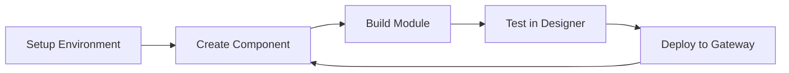

# Getting Started with Example Component Library

Welcome to the Example Component Library for Ignition Perspective! This guide will help you begin developing custom components for Ignition's Perspective module.

## Prerequisites

Before you begin, ensure you have:

- Basic knowledge of Java and React/TypeScript
- Familiarity with Ignition Perspective
- Development machine running Windows, macOS, or Linux

## Quick Overview

1. Set up your [development environment](environment-setup)
2. Follow the [quick start guide](quick-start) to build your first component
3. Check [troubleshooting](troubleshooting) if you encounter issues

## Development Flow

## Next Steps

- [Environment Setup Guide](environment-setup) - Set up your development tools
- [Quick Start Guide](quick-start) - Build your first component
- [Troubleshooting Guide](troubleshooting) - Common issues and solutions
