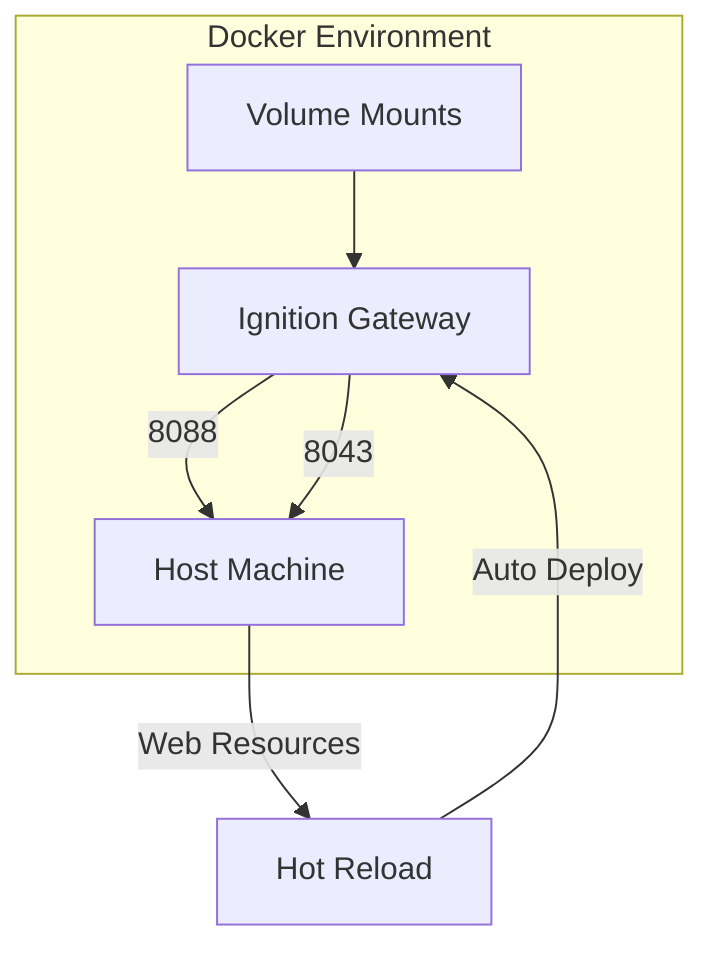

# Docker Development Environment

Our Docker setup provides a consistent development environment for all team members.

## Architecture



## Prerequisites

- Docker Desktop installed and running
- Docker Compose installed
- At least 4GB of free RAM

## Configuration

### Directory Structure

```
docker/
├── backups/              # Gateway backups
├── data/                 # Persistent gateway data
├── docker-compose.yml    # Environment configuration
└── .env                 # Environment variables
```

### Docker Compose Configuration

```yaml title="docker-compose.yml"
version: "3.8"
services:
  gateway:
    image: inductiveautomation/ignition:8.1.44
    ports:
      - "8088:8088" # HTTP
      - "8043:8043" # HTTPS
    volumes:
      - ./data:/var/lib/ignition
      - ./backups:/restore
      - ../web:/web-resources
    environment:
      ACCEPT_IGNITION_EULA: "Y"
      IGNITION_EDITION: "standard"
      RESTORE_ON_STARTUP: "true"
      GATEWAY_RESTORE_DISABLED: "false"
    command: >
      --
      -Dres.path.dev.bwdesigngroup.perspective.examples.ExampleComponentLibrary=/web-resources/build/generated-resources/mounted
```

## Usage

### Starting the Environment

```bash
# Navigate to docker directory
cd docker

# Start containers
docker-compose up -d

# View logs
docker-compose logs -f
```

### Stopping the Environment

```bash
docker-compose down
```

### Accessing the Gateway

- Web Interface: `http://localhost:8088`
- Gateway Admin: `http://localhost:8088/system/admin`
- Designer: Launch through Gateway web interface

## Volume Mounts

### Web Resources

```yaml
volumes:
  - ../web:/web-resources
```

This mount enables hot reloading of web resources during development.

:::warning Mount Permissions
Ensure your user has appropriate permissions for mounted directories. On Linux/macOS:

```bash
chmod -R 777 data backups
```

:::

## Environment Variables

```properties title=".env"
GATEWAY_ADMIN_USERNAME=admin
GATEWAY_ADMIN_PASSWORD=password
IGNITION_EDITION=standard
```

## Common Issues

### Port Conflicts

If ports 8088 or 8043 are in use:

1. Stop conflicting services
2. Modify port mappings in `docker-compose.yml`:
   ```yaml
   ports:
     - "8089:8088" # Map to different host port
   ```

### Volume Mount Issues

If web resources aren't updating:

1. Check volume mount permissions
2. Verify Docker has access to the mounted directories
3. Check Docker Desktop settings for file sharing

## Best Practices

1. **Gateway Backups**

   - Regularly update the backup in `docker/backups`
   - Include module configurations
   - Document backup contents

2. **Resource Management**

   - Clean up unused containers: `docker system prune`
   - Monitor container logs
   - Set appropriate resource limits

3. **Development Workflow**
   - Keep Docker environment running during development
   - Use hot reload for rapid development
   - Monitor resource usage
