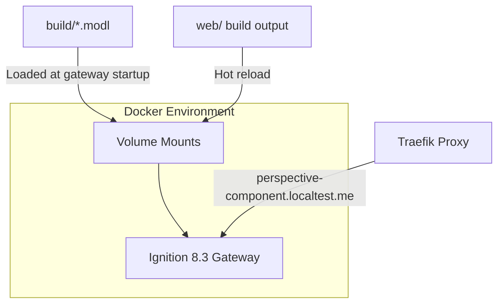

# Docker Development Environment

Our Docker setup provides a consistent Ignition 8.3 development environment for all team members.

## Architecture


```mermaid
graph TB
    subgraph "Docker Environment"
        A[Ignition 8.3 Gateway]
        C[Volume Mounts] --> A
    end
    P[Traefik Proxy] -- "perspective-component.localtest.me" --> A
    M[build/*.modl] -- "Loaded at gateway startup" --> C
    W[web/ build output] -- "Hot reload" --> C
```

## Prerequisites

- Docker Desktop installed and running
- Docker Compose installed
- At least 4GB of free RAM
- The module built at least once with `./gradlew build`

## Configuration

### Directory Structure

```
docker/
├── docker-compose.yml    # Environment configuration
└── .env                  # Optional environment variables
```

### Docker Compose Configuration

```yaml title="docker-compose.yml"
services:
  gateway:
    image: inductiveautomation/ignition:8.3.9
    environment:
      ACCEPT_IGNITION_EULA: Y
      GATEWAY_ADMIN_USERNAME: ${GATEWAY_USERNAME:-admin}
      GATEWAY_ADMIN_PASSWORD: ${GATEWAY_PASSWORD:-password}
      IGNITION_EDITION: standard
      # 8.3 treats this as an allowlist of fully-qualified module ids, including third-party modules
      GATEWAY_MODULES_ENABLED: com.inductiveautomation.perspective,dev.kgamble.perspective.examples.ExampleComponentLibrary
      # Accept the module's license and certificate on first boot so it loads without commissioning clicks
      ACCEPT_MODULE_LICENSES: dev.kgamble.perspective.examples.ExampleComponentLibrary
      ACCEPT_MODULE_CERTS: dev.kgamble.perspective.examples.ExampleComponentLibrary
      DISABLE_QUICKSTART: true
    volumes:
      # Ignition 8.3 loads modules only at startup. After `./gradlew build`, run `docker compose restart gateway`.
      # Set MODULE_FILE=Example-Component-Library.modl in docker/.env when building with signModule=true.
      - ../build/${MODULE_FILE:-Example-Component-Library.unsigned.modl}:/usr/local/bin/ignition/user-lib/modules/Example-Component-Library.modl
      - ../web:/web-resources
    labels:
      traefik.enable: "true"
      traefik.hostname: "perspective-component"
    command: >
      -n perspective-component-gateway
      --
      -Dignition.allowunsignedmodules=true
      -Dres.path.dev.kgamble.perspective.examples.ExampleComponentLibrary=/web-resources/build/generated-resources/mounted

    # If a traefik proxy container is not being used, comment out everything below this line (https://github.com/design-group/traefik-proxy)
    networks:
      - default
      - proxy

networks:
  default:
  proxy:
    external: true
    name: proxy
```

The gateway starts from a clean state on first boot. The environment variables handle the setup that would otherwise take clicks in the gateway web UI:

| Variable | Purpose |
| --- | --- |
| `ACCEPT_IGNITION_EULA` | Accepts the Ignition license agreement |
| `GATEWAY_ADMIN_USERNAME` / `GATEWAY_ADMIN_PASSWORD` | Creates the gateway admin user |
| `IGNITION_EDITION` | Runs the Standard edition |
| `GATEWAY_MODULES_ENABLED` | Allowlist of fully-qualified module ids to enable. Every module not listed, built-in or third-party, stays disabled, so this module's id must be in the list. |
| `ACCEPT_MODULE_LICENSES` / `ACCEPT_MODULE_CERTS` | Accepts this module's license and certificate, so it loads without the gateway's module commissioning prompts |
| `DISABLE_QUICKSTART` | Skips the quick start wizard |

The JVM arguments after `--` allow the unsigned development build to load (`-Dignition.allowunsignedmodules=true`) and serve web resources from your working copy for [hot reload](./hot-reload).

## Usage

### Starting the Environment

Build the module first, then start the gateway from the repository root:

```bash
./gradlew build
docker compose -f docker/docker-compose.yml up -d

# View logs
docker compose -f docker/docker-compose.yml logs -f
```

:::warning Build Needed
Build the module before starting the gateway. The `.modl` file is mounted into the container, and if it doesn't exist yet, Docker creates an empty directory in its place. To recover, run `docker compose -f docker/docker-compose.yml down`, then `./gradlew build`, then start the gateway again.
:::

### Loading a New Build

Ignition 8.3 loads modules only at startup. After rebuilding, restart the gateway:

```bash
./gradlew build
docker compose -f docker/docker-compose.yml restart gateway
```

### Stopping the Environment

```bash
docker compose -f docker/docker-compose.yml down
```

### Accessing the Gateway

- Gateway web interface: `https://perspective-component.localtest.me`
- Designer: Launch through the gateway web interface
- Modules: Platform > System > Modules

## Volume Mounts

### Module File

```yaml
volumes:
  - ../build/${MODULE_FILE:-Example-Component-Library.unsigned.modl}:/usr/local/bin/ignition/user-lib/modules/Example-Component-Library.modl
```

The gateway loads the built module from `user-lib/modules`. The default is the unsigned build. When you build with `signModule=true`, set `MODULE_FILE=Example-Component-Library.modl` in `docker/.env`.

### Web Resources

```yaml
volumes:
  - ../web:/web-resources
```

This mount, together with the `-Dres.path...` JVM argument, enables hot reloading of web resources during development.

## Environment Variables

```properties title=".env"
GATEWAY_USERNAME=admin
GATEWAY_PASSWORD=password
MODULE_FILE=Example-Component-Library.unsigned.modl
```

## Traefik Proxy

The gateway has no published ports. It joins the external `proxy` network, and a shared [Traefik proxy](https://github.com/design-group/traefik-proxy) routes `perspective-component.localtest.me` to it using the `traefik.hostname` label.

Without the proxy, remove the `networks` sections and publish the gateway's HTTP port instead:

```yaml
ports:
  - "8088:8088"
```

The gateway is then at `http://localhost:8088`.

## Designer Auto-Login

:::danger Auto-Login Warning
Auto-login should only be used for testing purposes and should not be used in a production environment.
:::

It is possible to auto-login to the designer for testing purposes, however it is noted that this is not secure and should not be used in a production environment. To enable this, add the following JVM args to your designer launcher config for this gateway:

```sh
-Dautologin.username=some_username;-Dautologin.password=some_password;-Djavaws.ignition.loglevel=INFO;-Djavaws.ignition.debug=true;-Dproject.name=some_project_name;
```

Note that the entire value must be on one line, and to replace the username, password, and project name with your own values.

## Common Issues

### Module Not Loading

1. Confirm the `.modl` file exists in `build/` and matches `MODULE_FILE`
2. Check that the module id is listed in `GATEWAY_MODULES_ENABLED`
3. Look for the module under Platform > System > Modules, including the quarantined list
4. Check the gateway logs for `Starting up module 'dev.kgamble.perspective.examples.ExampleComponentLibrary'`

### Volume Mount Issues

If web resources aren't updating:

1. Check that `npm run watch` is running and writing to `web/build/generated-resources/mounted`
2. Verify Docker has access to the mounted directories
3. Check Docker Desktop settings for file sharing

## Best Practices

1. **Resource Management**

   - Clean up unused containers: `docker system prune`
   - Monitor container logs
   - Set appropriate resource limits

2. **Development Workflow**
   - Keep Docker environment running during development
   - Use hot reload for web changes, and restart the gateway only for module changes
   - Monitor resource usage
