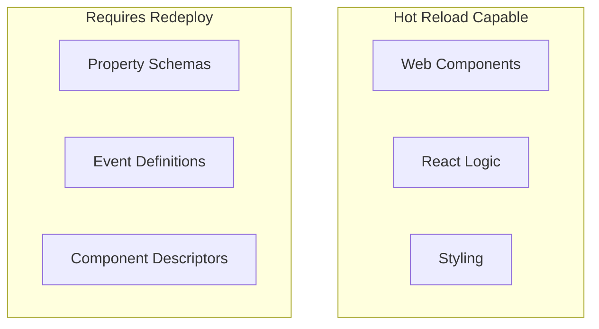

# Hot Reload Development

Hot reload enables rapid development by automatically updating your components as you make changes.

## Setup

1. Start the webpack watcher:

```bash
cd web
npm run watch
```

2. Open the Designer External Debugger:

   - Tools > Launch Perspective... > External Debugger
   - Keep this window open during development

3. After making changes to web components:
   - Save your files
   - Press Cmd+R (Mac) or Ctrl+R (Windows) in Designer to see updates

## Important Limitations

:::warning Component Property Changes
Changes to component properties defined in the `common` scope won't be picked up by hot reload. This includes:

- Modifications to `*.props.json` files
- Updates to Java component descriptors
- Changes to event definitions

For these changes, you must:

1. Rebuild and redeploy the module: `./gradlew build deployModl`
2. Restart the Designer completely
   :::



## Best Practices

1. Group related changes to property schemas to minimize rebuilds
2. Keep the External Debugger window open during development
3. Focus on component logic and styling during hot reload development
4. Save property and event changes for dedicated testing sessions
