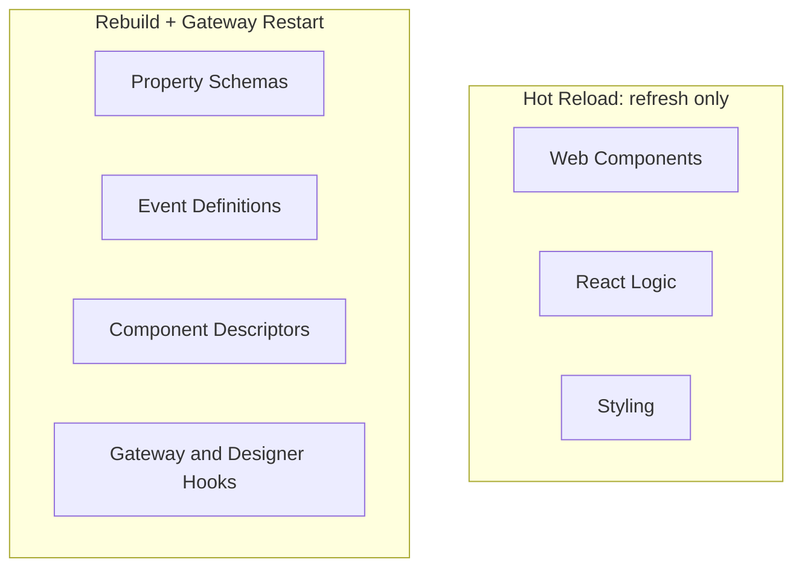

# Development Loop

Ignition 8.3 loads modules only when the gateway starts. A new or upgraded module is staged while the gateway runs and takes effect on the next restart. The development loop has two speeds:

- **Web assets** (TypeScript, React, CSS) hot reload. Save the file and refresh.
- **Module code** (Java, component descriptors, property schemas, event definitions) needs a rebuild and a gateway restart.


```mermaid
graph TB
    subgraph "Hot Reload: refresh only"
        A[Web Components]
        B[React Logic]
        C[Styling]
    end

    subgraph "Rebuild + Gateway Restart"
        E[Property Schemas]
        F[Event Definitions]
        G[Component Descriptors]
        H[Gateway and Designer Hooks]
    end
```

## Web Asset Hot Reload

The Docker gateway serves the module's web resources straight from your working copy instead of from the installed module. The compose file sets this JVM argument:

```
-Dres.path.dev.kgamble.perspective.examples.ExampleComponentLibrary=/web-resources/build/generated-resources/mounted
```

`/web-resources` is the `web/` folder mounted into the container, and `build/generated-resources/mounted` is where webpack writes `ExampleComponents.js` and `ExampleComponents.css`.

1. Start the webpack watcher:

```bash
cd web
npm run watch
```

2. Open the Designer External Debugger:

   - Tools > Launch Perspective... > External Debugger
   - Keep this window open during development

3. After making changes to web components:
   - Save your files
   - Press Cmd+R (Mac) or Ctrl+R (Windows) in Designer, or refresh the Perspective session in the browser

## Redeploying the Module

:::warning Component Property Changes
Changes to anything outside `web/` aren't picked up by hot reload. This includes:

- Modifications to `*.props.json` files
- Updates to Java component descriptors or module hooks
- Changes to event definitions

These need a rebuild, a gateway restart, and a Designer restart.
:::

### Docker Gateway

The compose file mounts the built module into the gateway's `user-lib/modules` folder, so a rebuild and a restart is all it takes:

```bash
./gradlew build
docker compose -f docker/docker-compose.yml restart gateway
```

Then close and reopen the Designer.

By default the compose file mounts `build/Example-Component-Library.unsigned.modl`. When you build with `signModule=true`, point it at the signed module instead by adding this line to `docker/.env`:

```properties title="docker/.env"
MODULE_FILE=Example-Component-Library.modl
```

### Any Ignition 8.3 Gateway

For a gateway that isn't the Docker environment, the `deployModule` Gradle task installs the module through the gateway's REST API. It uploads the module, accepts its certificate and license, and stages the install:

```bash
./gradlew deployModule -PhostGateway=http://my-gateway:8088 -PignitionApiToken=<name:secret>
```

Add `-PrestartGateway=true` to restart the gateway once the install is staged. Without it, the module loads on the next restart.

The task needs an API key:

1. In the gateway web UI, go to Platform > Security > API Keys and create a key.
2. Give the key a security level that has access to the gateway configuration APIs.
3. Pass the token as `-PignitionApiToken`, or set it in `gradle.properties` next to `hostGateway`:

```properties title="gradle.properties"
hostGateway=http://my-gateway:8088
ignitionApiToken=<name:secret>
```

:::info deployModl
The Ignition SDK Gradle plugin's `deployModl` task posts to a developer upload servlet that Ignition 8.3 doesn't have. This project makes `deployModl` fail with a pointer to `deployModule`.
:::

| Endpoint | Purpose |
| --- | --- |
| `POST /data/api/v1/modules/upload?fileName=` | Upload the `.modl` file |
| `POST /data/api/v1/modules/certificate?moduleId=` | Accept the signing certificate |
| `POST /data/api/v1/modules/eula?moduleId=` | Accept the module license |
| `POST /data/api/v1/modules/install?moduleId=` | Stage the install |
| `POST /data/api/v1/restart-tasks/restart?confirm=true` | Restart the gateway |

## Best Practices

1. Group related changes to property schemas to minimize rebuilds and restarts
2. Keep the External Debugger window open during development
3. Focus on component logic and styling during hot reload development
4. Save property and event changes for dedicated testing sessions
