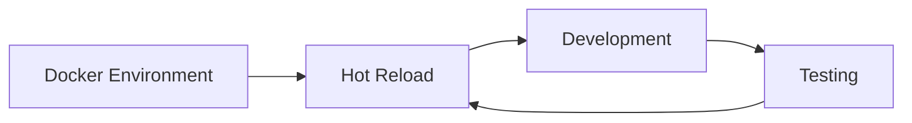

# Development Workflow

Our development workflow is designed to provide rapid feedback and a smooth development experience. This section covers:

## Key Topics

1. [Docker Setup](docker-setup) - Configure development environment
2. [Hot Reload](hot-reload) - Real-time development workflow
3. [Debugging](debugging) - Troubleshooting and debugging tools

## Quick Reference

| Tool             | Purpose                          |
| ---------------- | -------------------------------- |
| Docker           | Isolated development environment |
| Hot Reload       | Rapid development feedback       |
| Browser DevTools | Frontend debugging               |
| Java Debug       | Backend debugging                |

:::tip Development Best Practice
Always use the Docker development environment to ensure consistency across team members and match production environments.
:::
