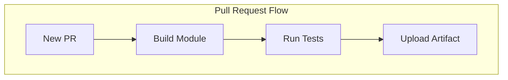
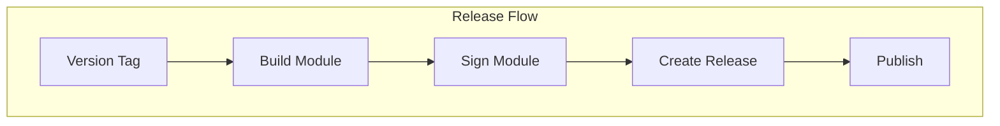
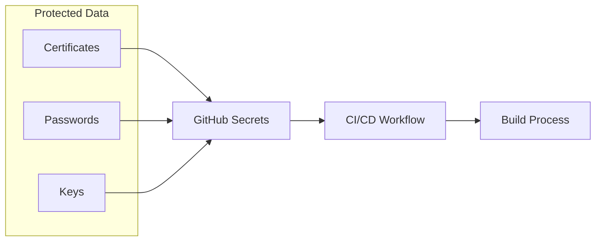

# Understanding CI/CD for Ignition Modules

Continuous Integration and Continuous Deployment (CI/CD) automates the building, testing, and releasing of your Ignition modules. Let's understand why each part matters and how it works.

## Why CI/CD?

CI/CD provides several benefits for Ignition module development:

1. **Quality Assurance**: Automatically test every change
2. **Consistency**: Every build follows the same process
3. **Automation**: Reduce manual steps and potential errors
4. **Validation**: Ensure changes don't break the build

## Pipeline Structure

Our CI/CD pipeline has two main workflows:





### Pull Request Validation

Pull request validation ensures code quality before merging:

```yaml title=".github/workflows/package.yaml"
name: Build PRs
on: pull_request
jobs:
  build:
    runs-on: ubuntu-latest
    steps:
      - uses: actions/checkout@v4
      - uses: actions/setup-java@v4
        with:
          distribution: "zulu"
          java-version: 17
          cache: "gradle"
      - name: Build
        run: ./gradlew build
```

This workflow:

1. Triggers on every pull request
2. Sets up Java for building
3. Builds the module to verify compilation
4. Preserves the artifact for review

:::tip Why Java 17?
We use Java 17 because it's the current LTS version supported by Ignition 8.1+. This ensures compatibility with the target platform.
:::

### Release Automation

The release process is more complex because it involves signing and publishing:

```yaml title=".github/workflows/release.yaml"
name: Release
on:
  push:
    tags:
      - "[0-9].[0-9].[0-9]" # Matches semantic versions
```

Key components explained:

1. **Trigger Conditions**:

   - Activates on version tags (e.g., "1.0.0")
   - Can be manually triggered for testing

2. **Certificate Handling**:

   ```yaml
   - name: Deserialize signing certs
     run: |
       echo "${{ secrets.CODE_SIGNING_CERT_BASE64 }}" | base64 --decode > cert.crt
   ```

   - Securely stores certificates as base64
   - Decodes at build time
   - Keeps sensitive data protected

3. **Build and Sign**:
   ```yaml
   - name: Build & Sign
     run: >
       ./gradlew
       -Pversion=${{ github.event.inputs.tag || github.ref_name }}
       -PsignModule=true
       build
       signModule
   ```
   - Uses the tag as the version
   - Enables module signing
   - Creates the final .modl file

## Secret Management

GitHub Secrets protect sensitive data:



Required secrets:

- `CODE_SIGNING_CERT_BASE64`: The certificate for signing
- `CODE_SIGNING_KEYSTORE_BASE64`: Java keystore containing private keys
- `CODE_SIGNING_CERT_PASSWORD`: Certificate password
- `CODE_SIGNING_KEYSTORE_PASSWORD`: Keystore password
- `CODE_SIGNING_CERT_ALIAS`: Certificate identifier in keystore

:::warning Security Best Practice
Never commit certificates or passwords to your repository. Always use repository secrets or secure environment variables.
:::

## Workflow Benefits

This setup provides several advantages:

1. **Automation**:

   - No manual build steps
   - Consistent process
   - Reduced human error

2. **Security**:

   - Protected credentials
   - Secure signing process
   - Controlled access

3. **Quality**:

   - Automated validation
   - Reproducible builds
   - Version tracking

4. **Efficiency**:
   - Quick feedback on PRs
   - Automated releases
   - Clear build history

## Common Issues and Solutions

### Build Failures

- **Symptom**: PR build fails
- **Check**:
  1. Build logs for errors
  2. Java version compatibility
  3. Dependencies resolution

### Signing Issues

- **Symptom**: Release signing fails
- **Check**:
  1. Secret configuration
  2. Certificate validity
  3. Keystore permissions

## Next Steps

After setting up CI/CD:

1. Learn about [module signing](signing)
2. Understand the [release process](releasing)
