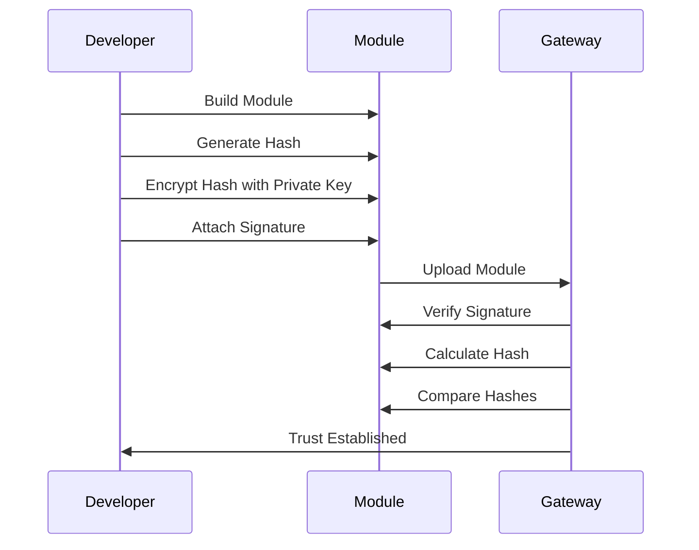

# Understanding Module Signing

## Why Sign Your Module?

Module signing serves several critical purposes:

1. **Authenticity**: Verifies you're the creator
2. **Integrity**: Ensures the module hasn't been tampered with
3. **Trust**: Helps users verify the module source
4. **Gateway Security**: Required for module acceptance


## Certificate Types

### Self-Signed (../Development)

- Quick to create
- Good for testing
- Not recommended for production
- No third-party verification

### CA-Signed (Production)

- Verified by trusted authority
- More secure
- Required for public distribution
- Takes longer to obtain

## Creating Certificates

### Development Certificate

```bash
# Generate a keystore and certificate
keytool -genkeypair \
  -alias mymodule \
  -keyalg RSA \
  -keysize 2048 \
  -keystore keystore.jks \
  -validity 3650
```

This command:

- Creates a new keystore (`keystore.jks`)
- Generates an RSA key pair
- Sets a 10-year validity period
- Stores under alias 'mymodule'

:::tip Key Size
We use 2048-bit RSA keys as a good balance between security and performance. 4096-bit keys are also acceptable but may impact build times.
:::

### Production Certificate Process

1. **Generate CSR**:

   ```bash
   keytool -certreq \
     -alias mymodule \
     -file module.csr \
     -keystore keystore.jks
   ```

2. **Submit to CA**:

   - Choose a reputable Certificate Authority
   - Follow their verification process
   - Pay any required fees

3. **Import Signed Certificate**:
   ```bash
   keytool -importcert \
     -alias mymodule \
     -file signed_cert.crt \
     -keystore keystore.jks
   ```

## How Signing Works



1. **Build Process**: Creates module content
2. **Hashing**: Creates unique fingerprint
3. **Signing**: Encrypts hash with private key
4. **Verification**: Gateway checks signature

## Implementing Signing

### Local Development

In `gradle.properties`:

```properties
signModule=true
```

Build command:

```bash
./gradlew build signModule \
  --certFile=module.crt \
  --certPassword=password \
  --keystoreFile=keystore.jks \
  --keystorePassword=password \
  --certAlias=mymodule
```

### CI/CD Integration

Store certificates securely:

1. Base64 encode files
2. Add to CI/CD secrets
3. Decode during build

```bash
# Encode for CI/CD
base64 -w 0 cert.crt > cert.base64
base64 -w 0 keystore.jks > keystore.base64
```

## Verifying Signatures

### Check Module Signature

```bash
keytool -printcert -file MyModule.modl
```

### Gateway Verification

1. Gateway receives module
2. Extracts certificate
3. Validates signature
4. Checks certificate trust

## Best Practices

1. **Key Security**

   - Secure private key storage
   - Limited access to certificates
   - Regular key rotation

2. **Certificate Management**

   - Track expiration dates
   - Plan renewal process
   - Backup certificates safely

3. **Development Flow**
   - Use self-signed for testing
   - CA-signed for production
   - Document certificate details

:::warning Certificate Storage
Never commit certificates or keystores to version control. Store securely and distribute through protected channels.
:::

## Common Issues

### Certificate Errors

- **Problem**: Gateway rejects signature
- **Solution**: Verify certificate chain and trust

### Signing Failures

- **Problem**: Build signing fails
- **Solution**: Check certificate and password accuracy
