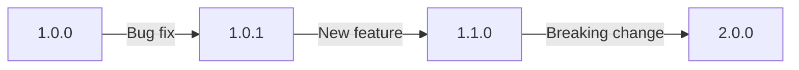
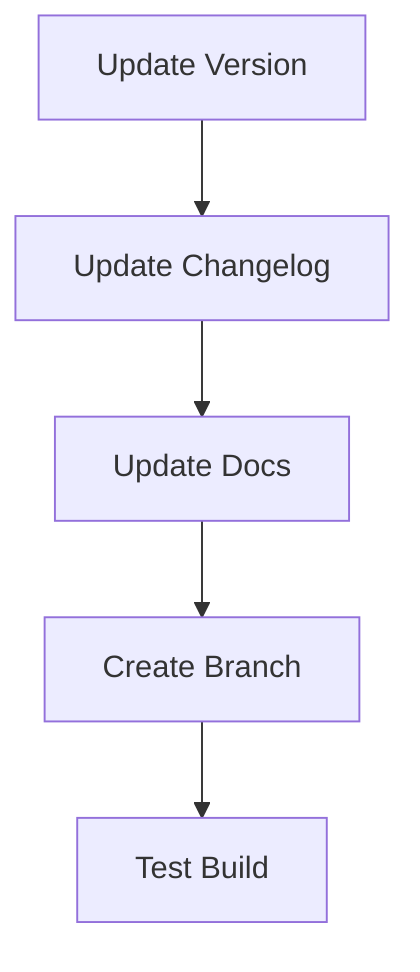
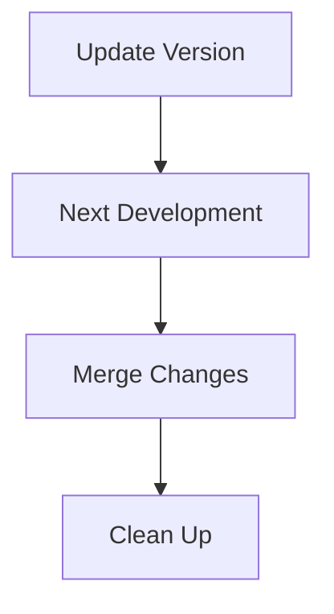

# Understanding Module Releases

## What is a Release?

A release represents a specific version of your module that's ready for distribution. It includes:

1. **Versioned Code**: Tagged snapshot of your codebase
2. **Built Artifacts**: Compiled and signed `.modl` file
3. **Documentation**: Changes and upgrade notes
4. **Distribution**: Published package

## Version Numbers

We use Semantic Versioning (SemVer):

```
MAJOR.MINOR.PATCH
  |     |     |
  |     |     └─ Bug fixes
  |     └─ New features (backwards compatible)
  └─ Breaking changes
```

Example version flow:



:::tip Version Choice

- Increment PATCH for bug fixes: 1.0.0 → 1.0.1
- Increment MINOR for new features: 1.0.1 → 1.1.0
- Increment MAJOR for breaking changes: 1.1.0 → 2.0.0
  :::

## Release Process

### 1. Preparation



Update version in `build.gradle.kts`:

```kotlin
allprojects {
    version = "1.0.0" // Remove -SNAPSHOT suffix
}
```

### 2. Documentation

Changelog entry:

```markdown
## [1.0.0] - 2024-11-14

### Added

- New feature X
- Support for Y

### Changed

- Improved performance of Z

### Fixed

- Bug in component A
```

### 3. Testing

Pre-release checklist:

- [ ] All tests pass
- [ ] Documentation updated
- [ ] Breaking changes noted
- [ ] Backwards compatibility verified
- [ ] Module builds correctly
- [ ] Signing works

### 4. Creating the Release

Manual process:

```bash
# Create release branch
git checkout -b release/1.0.0

# Commit version changes
git add .
git commit -m "chore: prepare release 1.0.0"

# Tag release
git tag -a 1.0.0 -m "Release version 1.0.0"

# Push to trigger CI/CD
git push origin 1.0.0
```

### 5. Post-Release



Update to next version:

```kotlin
allprojects {
    version = "1.1.0-SNAPSHOT"
}
```

## Release Types

### Development (-SNAPSHOT)

- Unstable builds
- Work in progress
- Not for production

### Release Candidates (RC)

- Feature complete
- Testing phase
- Almost ready

### Final Release

- Stable version
- Production ready
- Fully tested

## Distribution

### GitHub Releases

- Automated by CI/CD
- Includes built module
- Contains release notes

### Module Distribution

1. Signed `.modl` file
2. Release documentation
3. Installation instructions
4. Upgrade notes

## Best Practices

1. **Version Control**

   - Clear commit messages
   - Proper tags
   - Clean history

2. **Documentation**

   - Detailed changelog
   - Migration guides
   - Known issues

3. **Testing**
   - Comprehensive testing
   - Multiple Ignition versions
   - Different environments

## Common Scenarios

### Hotfix Release

For urgent fixes:

1. Branch from release tag
2. Fix issue
3. Increment patch version
4. Create new release

### Feature Release

For new features:

1. Complete feature development
2. Increment minor version
3. Update documentation
4. Create release

### Breaking Change

When breaking compatibility:

1. Document changes thoroughly
2. Increment major version
3. Provide migration guide
4. Extra testing

:::warning Release Checklist
Before any release:

- [ ] Version updated
- [ ] Changelog complete
- [ ] Tests passing
- [ ] Documentation updated
- [ ] Breaking changes documented
      :::
