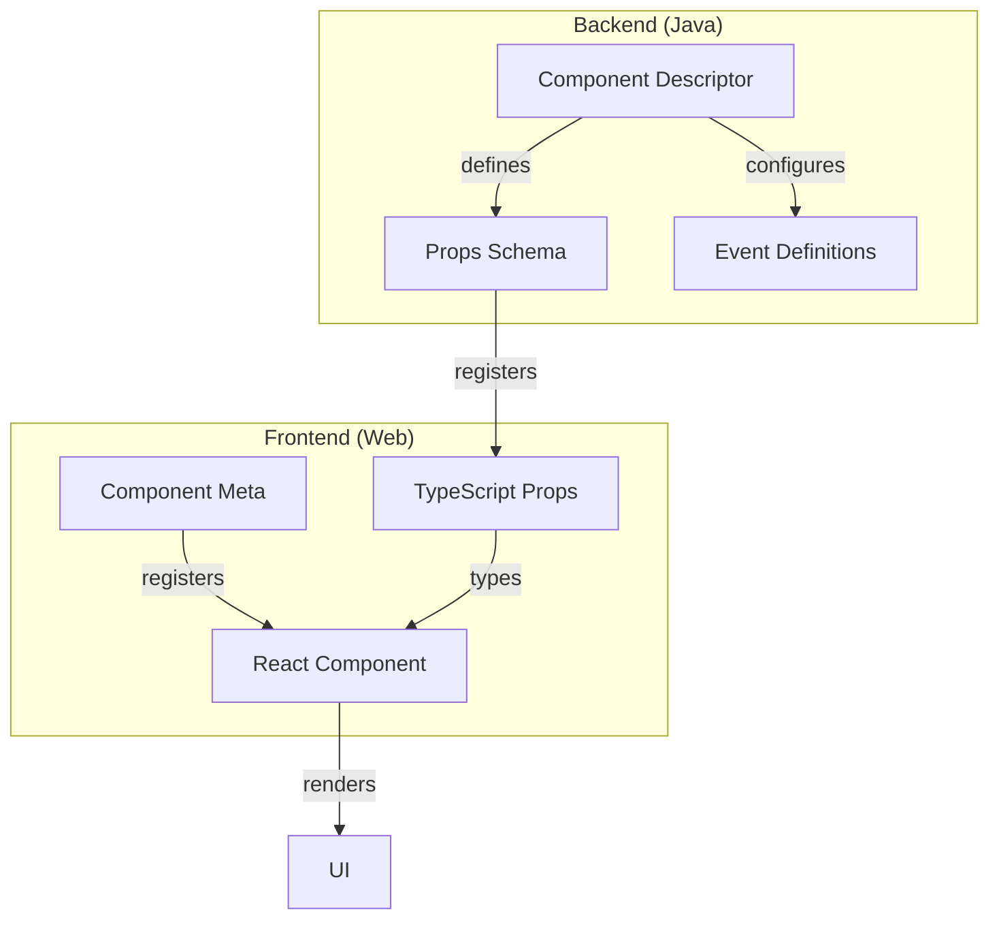

# Creating Perspective Components

This guide explains how to create new components for Perspective, covering both frontend and backend requirements.

## Component Architecture

A Perspective component consists of several parts working together:



## Step 1: Create React Component

Create a new TypeScript file in `web/src/components/`:

```typescript title="web/src/components/MyComponent.tsx"
import * as React from "react";
import {
  Component,
  ComponentMeta,
  ComponentProps,
  PComponent,
} from "@inductiveautomation/perspective-client";

// Define component props
export interface MyComponentProps {
  text?: string;
  onClick?: () => void;
}

// Create the component
export class MyComponent extends Component<ComponentProps<MyComponentProps>> {
  render() {
    const { text, onClick } = this.props;
    return <div onClick={onClick}>{text}</div>;
  }
}

// Define component metadata
export class MyComponentMeta implements ComponentMeta {
  getComponentType(): string {
    // Must match Java component ID
    return "examples.display.mycomponent";
  }

  getViewComponent(): PComponent {
    return MyComponent;
  }

  // Default size in Designer
  getDefaultSize(): SizeObject {
    return {
      width: 100,
      height: 50,
    };
  }
}
```

:::tip Component Organization
Organize components by category in the `components` directory:

- `display/` - Visual components
- `input/` - User input components
- `data/` - Data manipulation components
  :::

## Step 2: Define Props Schema

Create a JSON schema in `common/src/main/resources/props/`:

```json title="common/src/main/resources/props/mycomponent.props.json"
{
  "type": "object",
  "properties": {
    "text": {
      "type": "string",
      "description": "Display text",
      "default": "Hello World"
    },
    "onClick": {
      "type": "action",
      "description": "Click event handler"
    }
  }
}
```

## Step 3: Create Java Component Class

Create a Java class in `common/src/main/java/.../components/`:

```java title="common/src/main/java/.../components/MyComponent.java"
public class MyComponent {
    public static final String COMPONENT_ID = "examples.display.mycomponent";
    public static final String COMPONENT_NAME = "My Component";
    public static final String COMPONENT_DESCRIPTION =
        "A component that displays text";

    public static ComponentDescriptor DESCRIPTOR = ComponentDescriptorImpl.ComponentBuilder
        .newBuilder()
        .setPaletteCategory(ExampleComponents.COMPONENT_CATEGORY)
        .setId(COMPONENT_ID)
        .setModuleId(Constants.MODULE_ID)
        .setSchema(ComponentUtilities.getSchemaFromFilePath(
            "/props/mycomponent.props.json"))
        .addPaletteEntry(
            "",
            COMPONENT_NAME,
            COMPONENT_DESCRIPTION,
            null,
            null)
        .setName(COMPONENT_NAME)
        .setDefaultMetaName("myComponent")
        .setResources(ExampleComponents.BROWSER_RESOURCES)
        .build();
}
```

## Step 4: Register Component

### Gateway Registration

```java title="gateway/src/main/java/.../ExampleComponentLibraryGatewayHook.java"
@Override
public void startup(LicenseState license) {
    if (this.componentRegistry != null) {
        this.componentRegistry.registerComponent(MyComponent.DESCRIPTOR);
    }
}

@Override
public void shutdown() {
    if (this.componentRegistry != null) {
        this.componentRegistry.removeComponent(MyComponent.COMPONENT_ID);
    }
}
```

### Designer Registration

```java title="designer/src/main/java/.../ExampleComponentLibraryDesignerHook.java"
private void init() {
    ComponentUtilities.registerComponentWithIcon(
        registry,
        MyComponent.DESCRIPTOR,
        "/images/mycomponent-icon.svg"
    );
}

private void removeComponents() {
    registry.removeComponent(MyComponent.COMPONENT_ID);
}
```

## Step 5: Add Component Icon

Create an SVG icon in `designer/src/main/resources/images/`:

```svg title="designer/src/main/resources/images/mycomponent-icon.svg"
<svg xmlns="http://www.w3.org/2000/svg" viewBox="0 0 24 24">
  <!-- Your icon design -->
</svg>
```

## Step 6: Register in Frontend

Add your component to `web/src/index.ts`:

```typescript title="web/src/index.ts"
import { MyComponent, MyComponentMeta } from "./components/MyComponent";

export { MyComponent };

const components: Array<ComponentMeta> = [
  new MyComponentMeta(),
  // ... other components
];

components.forEach((c: ComponentMeta) => ComponentRegistry.register(c));
```

## Testing Your Component

1. Build and deploy the module:

   ```bash
   ./gradlew build deployModl
   ```

2. Open Ignition Designer

3. Create a new view and find your component in the palette

4. Test component functionality:
   - Property changes
   - Event handling
   - Sizing behavior
   - Error cases

:::warning Hot Reload Limitations
Remember that changes to Java classes or prop schemas require a module rebuild and Designer restart. Only web component changes support hot reload.
:::

## Best Practices

1. **Consistent Naming**

   - Match component IDs across frontend and backend
   - Use descriptive, category-based naming
   - Follow [naming conventions](./naming-conventions)

2. **Props Design**

   - Make props optional when possible
   - Provide sensible defaults
   - Document all props

3. **Error Handling**

   - Validate props
   - Handle edge cases
   - Provide meaningful error messages

4. **Performance**
   - Minimize re-renders
   - Optimize resource usage
   - Use React lifecycle methods appropriately

## Next Steps

- Learn about [module building](./build-system)
- Understand [resource management](./resource-management)
- Study our [naming conventions](./naming-conventions)
