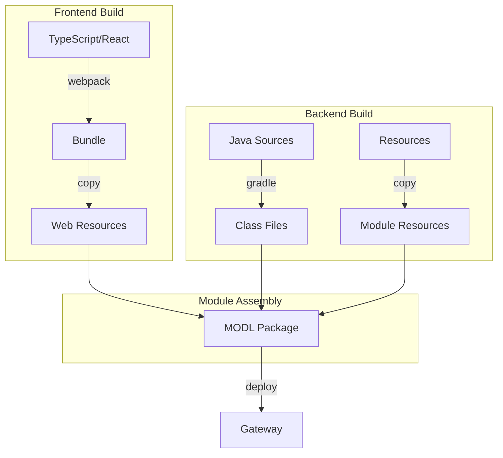

# Understanding the Build System

Our build system combines Gradle for Java compilation and module packaging with npm/webpack for frontend assets.

## Build Architecture



## Project Structure

```
example-component-library/
├── build.gradle.kts          # Root build configuration
├── settings.gradle.kts       # Project structure
├── common/                   # Shared code
├── designer/                 # Designer-specific code
├── gateway/                  # Gateway-specific code
└── web/                      # Frontend assets
```

## Gradle Configuration

### Root Build File

```kotlin title="build.gradle.kts"
plugins {
    id("io.ia.sdk.modl") version "0.3.0"
}

ignitionModule {
    // Module definition
    name.set("Example Component Library")
    fileName.set("Example-Component-Library.modl")
    id.set("dev.kgamble.perspective.examples")

    // Project scope mapping
    projectScopes.putAll(
        mapOf(
            ":gateway" to "G",
            ":designer" to "D",
            ":common" to "GD"
        )
    )
}
```

:::info Understanding Scopes

- **G**: Gateway-only code
- **D**: Designer-only code
- **GD**: Shared between Gateway and Designer
  :::

### Version Management

We use Gradle's version catalog for dependency management:

```toml title="gradle/libs.versions.toml"
[versions]
ignition = "8.1.44"

[libraries]
ignition-common = { module = "com.inductiveautomation.ignitionsdk:ignition-common", version.ref = "ignition" }
ignition-designer-api = { module = "com.inductiveautomation.ignitionsdk:designer-api", version.ref = "ignition" }
```

## Frontend Build Configuration

### Webpack Setup

```javascript title="web/webpack.config.js"
module.exports = {
  entry: "./src/index.ts",
  output: {
    filename: "ExampleComponents.js",
    path: resolve("build/generated-resources"),
  },
  module: {
    rules: [
      {
        test: /\.(ts|tsx)$/,
        use: "ts-loader",
      },
    ],
  },
};
```

### NPM Scripts

```json title="web/package.json"
{
  "scripts": {
    "build": "webpack --mode production",
    "watch": "webpack --mode development --watch",
    "lint": "eslint src/**/*.{ts,tsx}"
  }
}
```

## Build Process Explained

### 1. Frontend Build

The frontend build process:

1. Compiles TypeScript
2. Bundles components
3. Generates resource files

```bash
cd web
npm run build
```

### 2. Backend Build

Java compilation and resource processing:

1. Compiles Java sources
2. Processes resources
3. Creates JARs

```bash
./gradlew build
```

### 3. Module Assembly

Final steps:

1. Collects all artifacts
2. Signs module (if enabled)
3. Creates `.modl` file

## Resource Handling

### Web Resources

```kotlin title="gateway/build.gradle.kts"
tasks.processResources {
    from(project(":web").projectDir.resolve("build/generated-resources"))
}
```

### Static Resources

```kotlin
tasks.processResources {
    from("src/main/resources") {
        include("images/**")
        include("props/**")
    }
}
```

## Development Workflow

### Hot Reload Setup

1. Start webpack in watch mode:

   ```bash
   cd web
   npm run watch
   ```

2. Mount resources in Docker:
   ```yaml title="docker-compose.yml"
   volumes:
     - ../web:/web-resources
   ```

### Module Deployment

Deploy to local gateway:

```bash
./gradlew build deployModl
```

## Common Issues

### Build Failures

1. **Missing Dependencies**

   ```
   Could not resolve: com.inductiveautomation.ignitionsdk:ignition-common
   ```

   Solution: Check Maven repositories and credentials

2. **TypeScript Errors**
   ```
   TS2307: Cannot find module '@inductiveautomation/perspective-client'
   ```
   Solution: Verify npm dependencies and TypeScript configuration

### Resource Issues

1. **Resources Not Found**

   - Check resource paths
   - Verify resource mounting
   - Check Docker volume mounts

2. **Hot Reload Not Working**
   - Verify webpack watch mode
   - Check resource mounting
   - Clear browser cache

## Best Practices

1. **Dependency Management**

   - Use version catalog
   - Keep dependencies updated
   - Document version requirements

2. **Resource Organization**

   - Follow consistent structure
   - Use clear naming
   - Document resource locations

3. **Build Performance**
   - Enable Gradle daemon
   - Use build caching
   - Optimize webpack configuration

## Next Steps

- Learn about [adding components](Adding%20Components)
- Understand [naming conventions](naming-conventions)
- Set up [local development](../Development/docker-setup)
