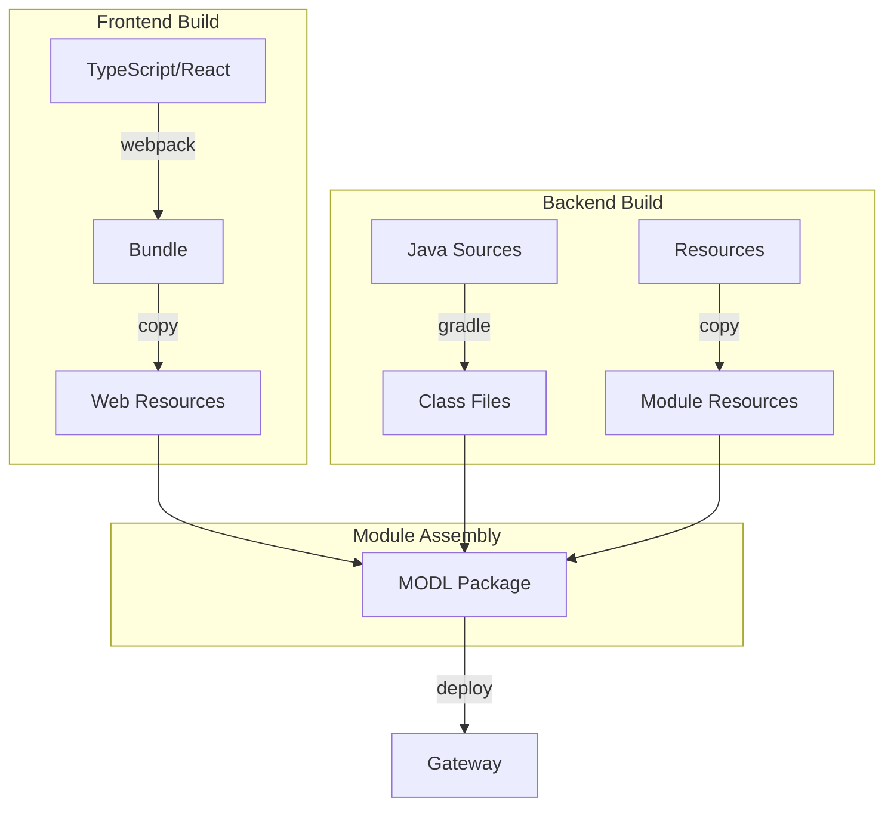

# Understanding the Build System

Our build system combines Gradle for Java compilation and module packaging with npm/webpack for frontend assets.

## Build Architecture


```mermaid
graph TB
    subgraph "Frontend Build"
        A[TypeScript/React] --> |webpack| B[Bundle]
        B --> |copy| C[Web Resources]
    end

    subgraph "Backend Build"
        D[Java Sources] --> |gradle| E[Class Files]
        F[Resources] --> |copy| G[Module Resources]
    end

    subgraph "Module Assembly"
        C --> H[MODL Package]
        E --> H
        G --> H
    end

    H --> |deploy| I[Gateway]
```

## Project Structure

```
example-component-library/
├── build.gradle.kts          # Root build configuration
├── settings.gradle.kts       # Project structure
├── common/                   # Shared code
├── designer/                 # Designer-specific code
├── gateway/                  # Gateway-specific code
└── web/                      # Frontend assets
```

## Gradle Configuration

### Root Build File

```kotlin title="build.gradle.kts"
plugins {
    id("io.ia.sdk.modl") version("0.5.0")
}

ignitionModule {
    // Module definition
    name.set("Example Component Library")
    fileName.set("Example-Component-Library.modl")
    id.set("dev.kgamble.perspective.examples.ExampleComponentLibrary")
    requiredIgnitionVersion.set("8.3.0")

    // Project scope mapping
    projectScopes.putAll(
        mapOf(
            ":gateway" to "G",
            ":web" to "G",
            ":designer" to "D",
            ":common" to "GD"
        )
    )
}
```

:::info Understanding Scopes

- **G**: Gateway-only code
- **D**: Designer-only code
- **GD**: Shared between Gateway and Designer
  :::

### Version Management

We use Gradle's version catalog for dependency management:

```toml title="gradle/libs.versions.toml"
[versions]
ignition = "8.3.9"

[libraries]
ignition-common = { module = "com.inductiveautomation.ignitionsdk:ignition-common", version.ref = "ignition" }
ignition-designer-api = { module = "com.inductiveautomation.ignitionsdk:designer-api", version.ref = "ignition" }
ignition-perspective-common = { module = "com.inductiveautomation.ignitionsdk:perspective-common", version.ref = "ignition" }
```

The Ignition SDK and Perspective libraries are `compileOnly` dependencies, because the gateway and Designer provide them at runtime. The Gradle wrapper is pinned to Gradle 8.7, and the modules target Java 17, the Java version Ignition 8.3 runs on.

The web project's Perspective packages track the same Ignition version:

```json title="web/package.json"
{
  "dependencies": {
    "@inductiveautomation/perspective-client": "2.3.9",
    "@inductiveautomation/perspective-common": "2.3.9"
  }
}
```

## Frontend Build Configuration

### Webpack Setup

```javascript title="web/webpack.config.js"
module.exports = {
  entry: "./src/index.ts",
  output: {
    library: "ExampleComponents",
    path: path.join(__dirname, "dist"),
    filename: "ExampleComponents.js",
    libraryTarget: "umd",
  },
  module: {
    rules: [
      {
        test: /\.(ts|tsx)$/,
        use: "ts-loader",
      },
    ],
  },
};
```

After each build, a plugin in `webpack.config.js` copies `ExampleComponents.js` and `ExampleComponents.css` from `dist/` to `build/generated-resources/mounted/`, which the gateway serves as the module's mounted resources.

### NPM Scripts

```json title="web/package.json"
{
  "scripts": {
    "watch": "webpack --mode development --watch",
    "clean": "rimraf dist build",
    "build": "npm run clean && webpack --mode production"
  }
}
```

## Build Process Explained

### 1. Frontend Build

The frontend build process:

1. Compiles TypeScript
2. Bundles components
3. Generates resource files

```bash
cd web
npm run build
```

### 2. Backend Build

Java compilation and resource processing:

1. Compiles Java sources
2. Processes resources
3. Creates JARs

```bash
./gradlew build
```

### 3. Module Assembly

Final steps:

1. Collects all artifacts
2. Signs module (if enabled)
3. Creates `.modl` file

## Resource Handling

### Web Resources

The `web` project runs webpack before processing its resources, and packages the output into its JAR:

```kotlin title="web/build.gradle.kts"
tasks {
    processResources {
        dependsOn(webpack)
        from(projectOutput) { into("") }
    }
}
```

The gateway project pulls that JAR into the module:

```kotlin title="gateway/build.gradle.kts"
dependencies {
    modlImplementation(projects.web)
}
```

### Static Resources

Files under each project's `src/main/resources` (images, `props/`, `events/`) are packaged into that project's JAR by Gradle's standard `processResources` task.

## Development Workflow

### Hot Reload Setup

1. Start webpack in watch mode:

   ```bash
   cd web
   npm run watch
   ```

2. Mount resources in Docker and point the module's resource path at them:
   ```yaml title="docker-compose.yml"
   volumes:
     - ../web:/web-resources
   command: >
     --
     -Dres.path.dev.kgamble.perspective.examples.ExampleComponentLibrary=/web-resources/build/generated-resources/mounted
   ```

### Module Deployment

Ignition 8.3 loads modules only at gateway startup. For the Docker gateway, rebuild and restart:

```bash
./gradlew build
docker compose -f docker/docker-compose.yml restart gateway
```

For any other Ignition 8.3 gateway, use the `deployModule` task with an API key:

```bash
./gradlew deployModule -PhostGateway=http://my-gateway:8088 -PignitionApiToken=<name:secret> -PrestartGateway=true
```

See [Development Loop](../Development/hot-reload) for details.

## Common Issues

### Build Failures

1. **Missing Dependencies**

   ```
   Could not resolve: com.inductiveautomation.ignitionsdk:ignition-common
   ```

   Solution: Check Maven repositories and credentials

2. **TypeScript Errors**
   ```
   TS2307: Cannot find module '@inductiveautomation/perspective-client'
   ```
   Solution: Verify npm dependencies and TypeScript configuration

### Resource Issues

1. **Resources Not Found**

   - Check resource paths
   - Verify resource mounting
   - Check Docker volume mounts

2. **Hot Reload Not Working**
   - Verify webpack watch mode
   - Check resource mounting and the `-Dres.path...` JVM argument
   - Clear browser cache

3. **Java or Schema Changes Not Showing**
   - Restart the gateway after rebuilding; Ignition 8.3 loads modules only at startup
   - Restart the Designer

## Best Practices

1. **Dependency Management**

   - Use version catalog
   - Keep dependencies updated
   - Document version requirements

2. **Resource Organization**

   - Follow consistent structure
   - Use clear naming
   - Document resource locations

3. **Build Performance**
   - Enable Gradle daemon
   - Use build caching
   - Optimize webpack configuration

## Next Steps

- Learn about [adding components](Adding%20Components)
- Understand [naming conventions](naming-conventions)
- Set up [local development](../Development/docker-setup)
