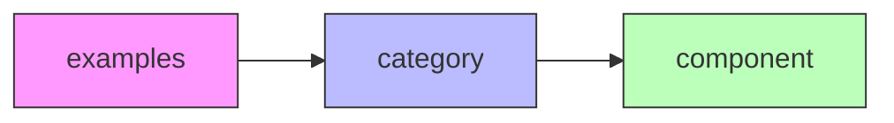
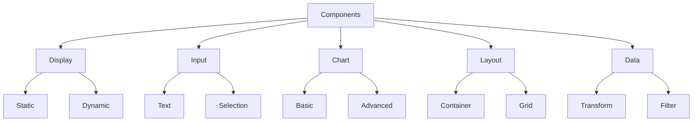

# Naming Conventions

Consistent naming is crucial for maintainable code and proper module functionality. This guide explains our naming patterns and why they matter.

## Module Identification

### Module ID Pattern

```
{organization}.{product}.{category}.{name}
```

Example:

```java
dev.kgamble.perspective.examples.ExampleComponentLibrary
```

:::info Why This Pattern?

- Organization prefix prevents conflicts
- Product category aids discovery
- Descriptive name explains purpose
- Matches Java package conventions
  :::

## Component Naming

### Component ID Structure



Example:

```
examples.display.button
examples.input.textfield
examples.chart.linegraph
```

### Consistent Cross-file Naming

| Component Type   | Pattern               | Example                   |
| ---------------- | --------------------- | ------------------------- |
| TypeScript Class | PascalCase            | `MyComponent`             |
| Props Interface  | PascalCase + Props    | `MyComponentProps`        |
| Meta Class       | PascalCase + Meta     | `MyComponentMeta`         |
| Java Class       | PascalCase            | `MyComponent`             |
| Props Schema     | kebab-case.props.json | `my-component.props.json` |
| Icon File        | kebab-case-icon.svg   | `my-component-icon.svg`   |

## File Organization

### Directory Structure

```
module/
├── common/
│   ├── src/main/java/.../components/
│   │   ├── display/
│   │   ├── input/
│   │   └── chart/
│   └── src/main/resources/
│       ├── props/
│       └── events/
├── web/
│   └── src/components/
│       ├── display/
│       ├── input/
│       └── chart/
└── designer/
    └── src/main/resources/
        └── images/
```

## Component Categories

Standard categories for organizing components:



## Code Conventions

### Java

```java title="common/src/main/java/.../components/MyComponent.java"
public class MyComponent {
    // Constants in UPPER_SNAKE_CASE
    public static final String COMPONENT_ID = "examples.display.mycomponent";
    public static final String COMPONENT_NAME = "My Component";

    // Methods in camelCase
    public static ComponentDescriptor getDescriptor() {
        return DESCRIPTOR;
    }
}
```

### TypeScript

```typescript title="web/src/components/MyComponent.tsx"
// Interface names in PascalCase
export interface MyComponentProps {
  // Props in camelCase
  backgroundColor?: string;
  onValueChange?: (value: string) => void;
}

// Component class in PascalCase
export class MyComponent extends Component<ComponentProps<MyComponentProps>> {
  // Private methods prefixed with _
  private _handleChange = (event: React.ChangeEvent<HTMLInputElement>) => {
    // Implementation
  };
}
```

## Resource Naming

### Props Schema

```json title="common/src/main/resources/props/my-component.props.json"
{
  "type": "object",
  "properties": {
    // Property names in camelCase
    "backgroundColor": {
      "type": "string"
    },
    "onValueChange": {
      "type": "action"
    }
  }
}
```

### Event Schemas

```json title="common/src/main/resources/events/my-component/value-change.json"
{
  "name": "valueChange",
  "parameters": {
    // Parameter names in camelCase
    "newValue": {
      "type": "string"
    }
  }
}
```

## Common Patterns

### Component Property Names

```typescript
// Common property patterns
interface CommonProps {
  // Style properties
  backgroundColor?: string;
  borderRadius?: number;

  // State properties
  isDisabled?: boolean;
  isLoading?: boolean;

  // Event handlers
  onClick?: () => void;
  onValueChange?: (value: any) => void;

  // Data properties
  value?: any;
  defaultValue?: any;
}
```

### Event Handler Names

Pattern: `on` + `Event`

```typescript
// Event handler naming
interface EventProps {
  onClick?: () => void;
  onMouseEnter?: () => void;
  onValueChange?: (value: any) => void;
  onSelectionComplete?: (items: string[]) => void;
}
```

## Best Practices

1. **Consistency**

   - Use the same name across all files
   - Follow established patterns
   - Document deviations

2. **Clarity**

   - Use descriptive names
   - Avoid abbreviations
   - Be explicit about purpose

3. **Organization**
   - Group related components
   - Maintain folder structure
   - Use clear categories

## Common Mistakes

### ❌ Incorrect

```typescript
// Inconsistent naming
examples.Buttons.customBtn; // Wrong casing
button - component; // Missing category
MyCustomBtn; // Inconsistent abbreviation
```

### ✅ Correct

```typescript
// Consistent naming
examples.button.custom; // Correct structure
examples.input.textField; // Clear category
examples.display.indicator; // Descriptive name
```

## Validation Checklist

When adding a new component:

- [ ] Component ID follows pattern
- [ ] Files use consistent names
- [ ] Properties follow conventions
- [ ] Events follow naming pattern
- [ ] Resources in correct locations
- [ ] Categories properly assigned

## Tips for Success

1. **New Components**

   - Copy existing component as template
   - Update all instances of the name
   - Verify all file locations

2. **Refactoring**

   - Use search/replace carefully
   - Check all related files
   - Test after renaming

3. **Documentation**
   - Comment non-obvious names
   - Explain category choices
   - Document special cases

:::tip IDE Support
Use IDE refactoring tools when renaming to ensure all references are updated correctly.
:::

## Next Steps

- Review [adding components](Adding%20Components) guide
- Understand [build system](build-system)
- Set up [development environment](../Development/docker-setup)
