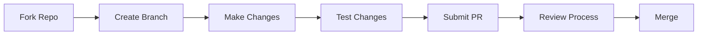

# Contributing to Example Component Library

First off, thank you for considering contributing to Example Component Library! This section will help you understand our contribution process and development practices.

## Quick Links

- [Code Style Guide](code-style)
- [Pull Request Guide](pull-requests)
- [Issue Tracker](https://github.com/keith-gamble/example-perspective-component-module/issues)

## Ways to Contribute

There are many ways to contribute to the project:

### 1. Code Contributions

- Fix bugs
- Add new components
- Improve existing components
- Enhance documentation
- Add tests

### 2. Non-Code Contributions

- Report bugs
- Suggest enhancements
- Improve documentation
- Help other users
- Write tutorials

## Getting Started

1. Set up your [development environment](../Getting Started/environment-setup)
2. Fork and clone the repository
3. Create a new branch for your work
4. Make your changes following our [code style guide](code-style)
5. Submit a PR following our [pull request guide](pull-requests)

## Development Workflow

## Contribution Guidelines

### 1. Code Quality

- Follow our [code style guide](code-style)
- Include tests for new features
- Update documentation as needed
- Use meaningful commit messages

### 2. Pull Requests

- Keep changes focused and atomic
- Reference related issues
- Update CHANGELOG.md
- Verify all tests pass

### 3. Documentation

- Update relevant docs
- Include inline comments
- Add examples where helpful
- Use clear, concise language

## Development Best Practices

1. **Component Development**

   - Follow naming conventions
   - Include PropTypes
   - Write unit tests
   - Document props and methods

2. **Testing**

   - Write unit tests
   - Test in different contexts
   - Verify all scopes (Gateway/Designer)
   - Check error cases

3. **Documentation**
   - Update related docs
   - Include examples
   - Explain complex logic
   - Add comments

## Getting Help

Need assistance? Here's how to get help:

1. Check the [documentation](../)
2. Search [existing issues](https://github.com/keith-gamble/example-perspective-component-module/issues)
3. Ask in [Discussions](https://github.com/keith-gamble/example-perspective-component-module/discussions)
4. Join our community chat

## Recognition

Contributors are recognized in several ways:

- Listed in CONTRIBUTORS.md
- Mentioned in release notes
- Credited in documentation

:::tip First Time Contributors
New to contributing? Look for issues labeled `good-first-issue` or `help-wanted`. These are specifically curated for new contributors.
:::

## License

By contributing, you agree that your contributions will be licensed under the [MIT License](../../../LICENSE.txt).

## Next Steps

- Review our [Code Style Guide](code-style)
- Learn about our [Pull Request Process](pull-requests)
- Set up your [Development Environment](../Getting Started/environment-setup)
