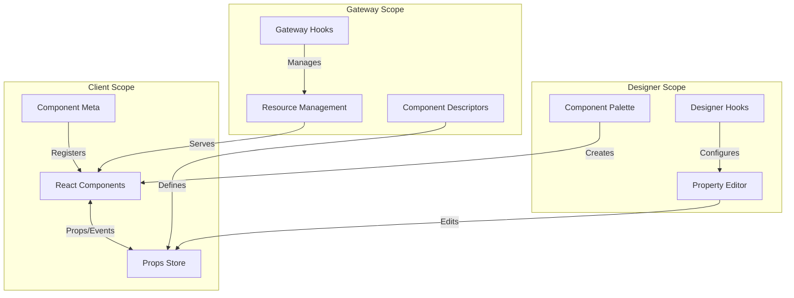
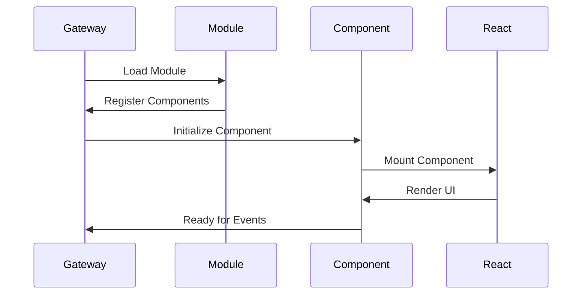
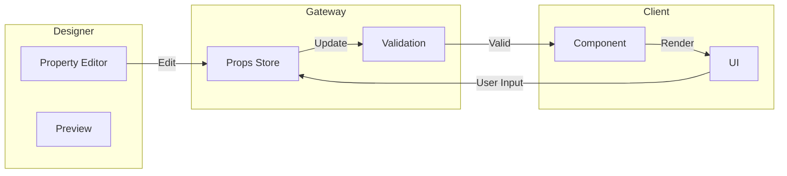
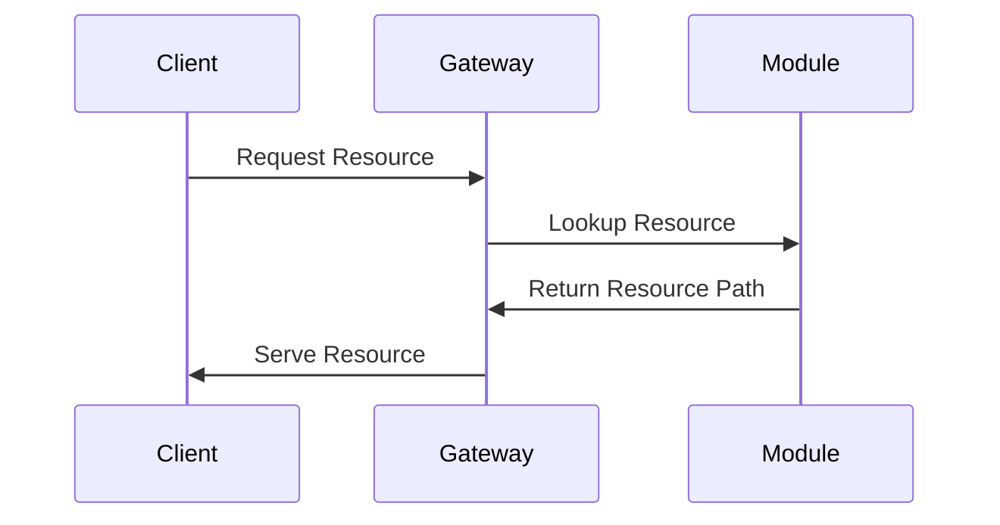
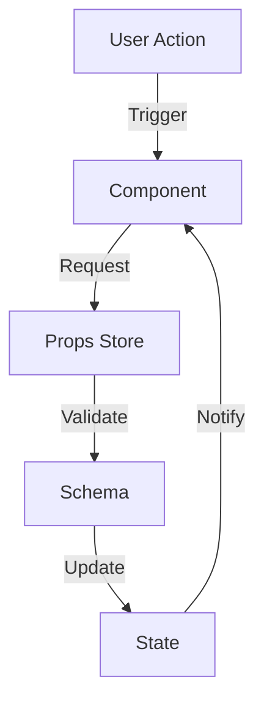
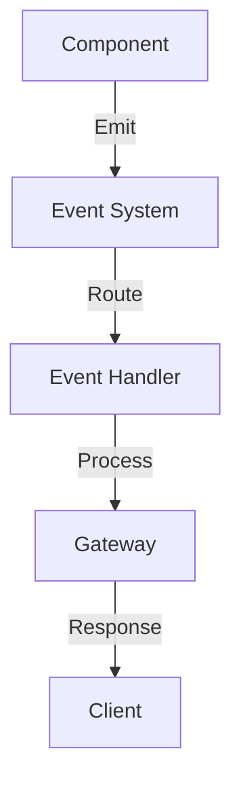
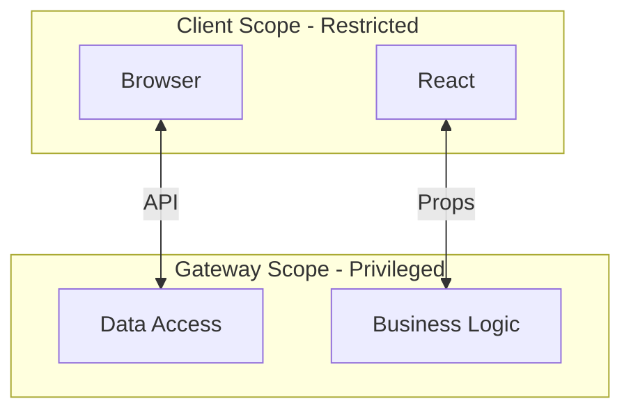
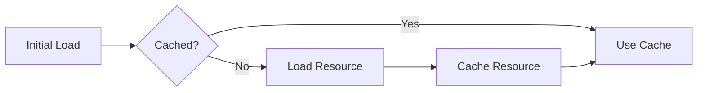
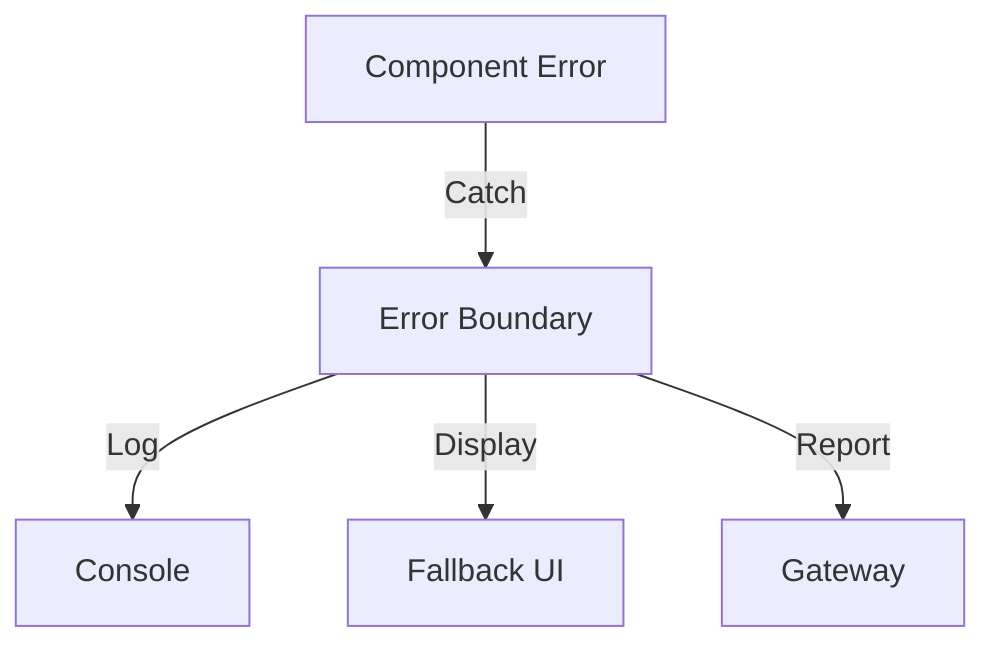

# Module Architecture

This guide explains how Perspective components work internally, how they communicate between scopes, and how the pieces fit together.

## High-Level Overview



## Component Lifecycle

### Initialization Flow



## Scope Communication

### Props Flow



## Resource Architecture

### Static Resources

```
module/
├── web/
│   └── build/
│       └── resources/
│           ├── js/
│           └── css/
├── common/
│   └── resources/
│       ├── props/
│       └── events/
└── designer/
    └── resources/
        └── images/
```

### Dynamic Resource Loading



## Data Flow

### Property Updates



### Event Handling



## Security Model

### Scope Boundaries



## Performance Considerations

### Resource Loading

- Bundling strategy
- Lazy loading
- Caching mechanisms



### Component Optimization

- Props memoization
- Render optimization
- Event debouncing

## Error Handling

### Error Boundaries



## Best Practices

### Component Design

1. **Separation of Concerns**

   - Keep view logic in React
   - Business logic in Gateway
   - Validation in schemas

2. **Resource Management**

   - Optimize bundle size
   - Use lazy loading
   - Implement caching

3. **Error Handling**
   - Implement boundaries
   - Provide fallbacks
   - Log effectively

### Performance

1. **Component Lifecycle**

   - Minimize renders
   - Clean up resources
   - Cache computations

2. **Data Flow**
   - Batch updates
   - Debounce events
   - Validate early

## Common Patterns

### State Management

```typescript
// Using Props Store
class MyComponent extends Component<MyComponentProps> {
  handleUpdate = () => {
    this.props.store.props.write("value", newValue);
  };
}
```

### Resource Loading

```java
public static final Set<BrowserResource> BROWSER_RESOURCES = Set.of(
    new BrowserResource(
        "example-components-js",
        "/res/example-components/bundle.js",
        BrowserResource.ResourceType.JS
    )
);
```

## Troubleshooting Guide

### Common Issues

1. **Resource Loading**

   - Check paths
   - Verify mounting
   - Check permissions

2. **Props Updates**

   - Validate schema
   - Check store connection
   - Verify scope access

3. **Event Handling**
   - Confirm registration
   - Check event routing
   - Verify handlers

## Next Steps

- Review [Component Schema](component-schema)
- Study [Naming Conventions](../Guides/naming-conventions)
- Explore [Development Setup](../Development/docker-setup)
