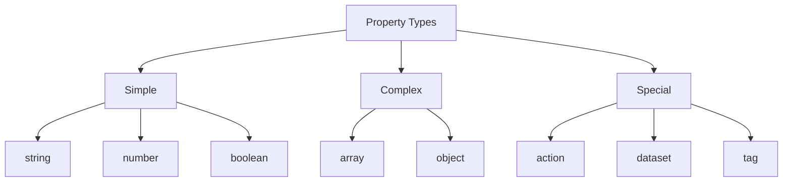

# Component Schema Reference

This guide details how to define and use component schemas in Perspective modules.

## Schema Structure

### Basic Schema

```json
{
  "type": "object",
  "properties": {
    "propertyName": {
      "type": "string",
      "description": "Property description",
      "default": "Default value"
    }
  }
}
```

## Property Types

### Basic Types



### Type Examples

```json
{
  "type": "object",
  "properties": {
    "text": {
      "type": "string",
      "description": "Display text"
    },
    "fontSize": {
      "type": "number",
      "minimum": 8,
      "maximum": 72
    },
    "isEnabled": {
      "type": "boolean",
      "default": true
    },
    "items": {
      "type": "array",
      "items": {
        "type": "string"
      }
    },
    "style": {
      "type": "object",
      "properties": {
        "color": { "type": "string" },
        "padding": { "type": "number" }
      }
    },
    "onClick": {
      "type": "action"
    },
    "data": {
      "type": "dataset"
    },
    "tagPath": {
      "type": "tag"
    }
  }
}
```

## Special Properties

### Actions

```json
{
  "onClick": {
    "type": "action",
    "description": "Click event handler",
    "parameters": [
      {
        "name": "value",
        "type": "string"
      },
      {
        "name": "event",
        "type": "object"
      }
    ]
  }
}
```

### Datasets

```json
{
  "data": {
    "type": "dataset",
    "description": "Data to display",
    "columns": [
      {
        "name": "timestamp",
        "type": "datetime"
      },
      {
        "name": "value",
        "type": "number"
      }
    ]
  }
}
```

### Tags

```json
{
  "tagPath": {
    "type": "tag",
    "description": "Tag to bind",
    "dataType": "float",
    "readOnly": false
  }
}
```

## Validation Rules

### String Validation

```json
{
  "text": {
    "type": "string",
    "minLength": 1,
    "maxLength": 100,
    "pattern": "^[A-Za-z0-9]+$"
  }
}
```

### Numeric Validation

```json
{
  "value": {
    "type": "number",
    "minimum": 0,
    "maximum": 100,
    "multipleOf": 0.5
  }
}
```

### Array Validation

```json
{
  "items": {
    "type": "array",
    "minItems": 1,
    "maxItems": 10,
    "uniqueItems": true,
    "items": {
      "type": "string"
    }
  }
}
```

## Property Categories

### Visual Properties

```json
{
  "type": "object",
  "properties": {
    "style": {
      "type": "object",
      "properties": {
        "backgroundColor": {
          "type": "string",
          "format": "color"
        },
        "borderRadius": {
          "type": "number",
          "minimum": 0
        },
        "padding": {
          "type": "number",
          "minimum": 0
        }
      }
    }
  }
}
```

### Behavior Properties

```json
{
  "type": "object",
  "properties": {
    "isEnabled": {
      "type": "boolean",
      "default": true
    },
    "isVisible": {
      "type": "boolean",
      "default": true
    },
    "isRequired": {
      "type": "boolean",
      "default": false
    }
  }
}
```

### Data Properties

```json
{
  "type": "object",
  "properties": {
    "value": {
      "type": "string"
    },
    "defaultValue": {
      "type": "string"
    },
    "placeholder": {
      "type": "string"
    }
  }
}
```

## Component Implementation

### TypeScript Interface

```typescript
interface MyComponentProps {
  // Match schema properties
  text?: string;
  fontSize?: number;
  isEnabled?: boolean;
  items?: string[];
  style?: {
    color?: string;
    padding?: number;
  };
  onClick?: () => void;
  data?: Dataset;
  tagPath?: string;
}
```

### Property Access

```typescript
class MyComponent extends Component<ComponentProps<MyComponentProps>> {
  render() {
    const { text, fontSize, isEnabled, style, onClick } = this.props;

    return (
      <div
        style={{
          ...style,
          fontSize: fontSize,
        }}
        onClick={onClick}
      >
        {text}
      </div>
    );
  }
}
```

## Best Practices

1. **Schema Design**

   - Use clear property names
   - Add descriptions
   - Set default values
   - Include validation

2. **Type Safety**

   - Match TypeScript types
   - Validate prop usage
   - Handle optional props

3. **Documentation**
   - Document all properties
   - Explain validations
   - Provide examples

## Common Patterns

### Forms

```json
{
  "type": "object",
  "properties": {
    "label": {
      "type": "string"
    },
    "value": {
      "type": "string"
    },
    "validation": {
      "type": "object",
      "properties": {
        "required": {
          "type": "boolean"
        },
        "pattern": {
          "type": "string"
        }
      }
    }
  }
}
```

### Data Display

```json
{
  "type": "object",
  "properties": {
    "data": {
      "type": "dataset"
    },
    "columns": {
      "type": "array",
      "items": {
        "type": "object",
        "properties": {
          "field": {
            "type": "string"
          },
          "title": {
            "type": "string"
          }
        }
      }
    }
  }
}
```

## Next Steps

- Study [Architecture Overview](architecture)
- Review [Naming Conventions](../Guides/naming-conventions)
- Learn about [Adding Components](../Guides/adding-components)
