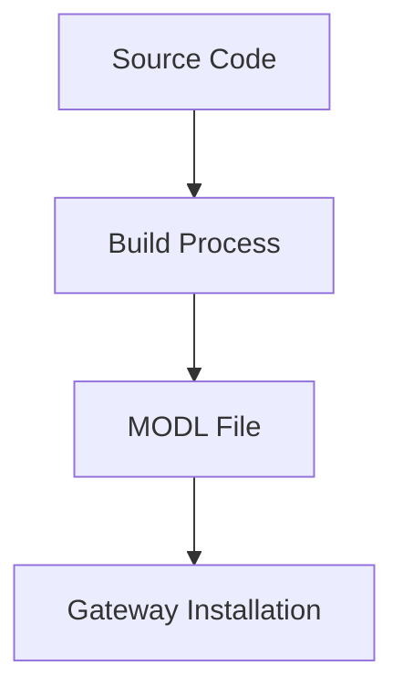
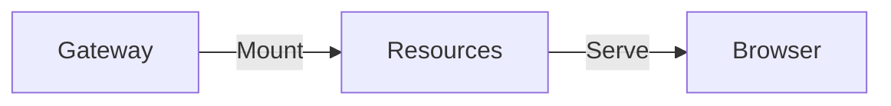

# Technical Glossary

## Core Concepts

### Gateway

The central server application in Ignition that manages projects, modules, and connections.

:::info Usage Example
The Gateway hosts Perspective sessions and serves components to clients.

```java
public class ExampleGatewayHook extends AbstractGatewayModuleHook {
    @Override
    public void startup() {
        // Gateway initialization code
    }
}
```

:::

### Designer

The application used to create and configure Ignition projects, including Perspective views.

:::info Usage Example
The Designer provides a component palette and property editor for configuring components.

```java
public class ExampleDesignerHook extends AbstractDesignerModuleHook {
    @Override
    public void startup() {
        // Designer initialization code
    }
}
```

:::

### Component

A reusable UI element in Perspective, built with React and TypeScript.

:::info Usage Example

```typescript
export class MyComponent extends Component<MyComponentProps> {
  render() {
    return <div>{this.props.text}</div>;
  }
}
```

:::

## Module Structure

### MODL File

The packaged module format used by Ignition for distribution.



### Scope

Defines where code runs: Gateway (G), Designer (D), or Client (C).

:::info Usage Example

```kotlin
projectScopes.putAll(mapOf(
    ":gateway" to "G",
    ":designer" to "D",
    ":common" to "GD"
))
```

:::

### Hook

A Java class that initializes and manages module functionality within a specific scope.

## Development Tools

### Gradle

Build automation tool used for compiling code and packaging modules.

:::info Usage Example

```bash
./gradlew build deployModl
```

:::

### Webpack

Module bundler for JavaScript applications, used to compile frontend assets.

:::info Usage Example

```javascript
module.exports = {
  entry: "./src/index.ts",
  output: {
    filename: "bundle.js",
  },
};
```

:::

### TypeScript

A typed superset of JavaScript used for component development.

:::info Usage Example

```typescript
interface MyProps {
  text: string;
  onClick?: () => void;
}
```

:::

## Component Architecture

### Component Meta

Metadata class that describes a component's configuration and behavior.

```typescript
export class MyComponentMeta implements ComponentMeta {
  getComponentType(): string {
    return "example.mycomponent";
  }
}
```

### Props

Properties that configure a component's behavior and appearance.

```typescript
interface ButtonProps {
  text: string;
  onClick?: () => void;
  style?: React.CSSProperties;
}
```

### Component Descriptor

Java class that defines a component's capabilities and configuration.

```java
public static final ComponentDescriptor DESCRIPTOR = ComponentDescriptorImpl
    .ComponentBuilder.newBuilder()
    .setId(COMPONENT_ID)
    .setName(COMPONENT_NAME)
    .build();
```

## Resource Management

### Browser Resource

A web resource (JS/CSS) served to the client's browser.

```java
new BrowserResource(
    "example-js",
    "/res/example/bundle.js",
    BrowserResource.ResourceType.JS
)
```

### Resource Mounting

Process of making resources available to the web browser from the Gateway.



## Development Environment

### Docker

Platform used for creating consistent development environments.

:::info Usage Example

```yaml
version: "3.8"
services:
  gateway:
    image: inductiveautomation/ignition:8.1.34
```

:::

### Hot Reload

Development feature that updates components without full rebuilds.

:::info Usage Example

```bash
npm run watch
```

:::

## Version Control

### Version Catalog

Gradle feature for centralizing dependency versions.

```toml
[versions]
ignition = "8.1.34"

[libraries]
ignition-common = { module = "com.inductiveautomation.ignitionsdk:ignition-common", version.ref = "ignition" }
```

### Module Version

The semantic version number of your module.

```kotlin
allprojects {
    version = "1.0.0"
}
```

## Testing & Debugging

### External Debugger

Tool for debugging Perspective components in Designer.

:::tip
Access via Tools > Launch Perspective... > External Debugger
:::

### Console Logging

Method for debugging components during development.

```typescript
console.log("Component mounted:", this.props);
console.error("Error in component:", error);
```

## Security

### Module Signing

Process of digitally signing modules for verification.

```bash
keytool -genkeypair -alias mymodule -keystore keystore.jks
```

### Certificate

Digital certificate used for signing modules.

:::warning
Keep certificates and private keys secure and never commit them to version control.
:::

## Additional Resources

- [Ignition SDK Documentation](https://docs.inductiveautomation.com/display/SDK)
- [TypeScript Documentation](https://www.typescriptlang.org/docs)
- [React Documentation](https://reactjs.org/docs)
- [Gradle Documentation](https://docs.gradle.org)

## Common Abbreviations

- **SDK**: Software Development Kit
- **API**: Application Programming Interface
- **UI**: User Interface
- **CSS**: Cascading Style Sheets
- **JSON**: JavaScript Object Notation
- **JDK**: Java Development Kit
- **NPM**: Node Package Manager

## Additional Terms

Want to suggest a term for this glossary? [Submit an issue](https://github.com/keith-gamble/example-perspective-component-module/issues/new) with the label `documentation`.
